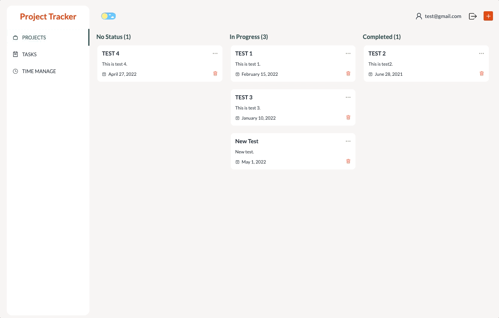

# Project Tracker

[View Demo here](https://project-tracker-khkm.onrender.com)  
*Please allow some time for the app to load. 

A project tracker app built with MERN stack (Mongo DB, Express, React JS, Node.js).  
I used Firebase for user authentication. After users log in, they can create a new project and manage it. This app allows users to show and manage all projects by status and all tasks and due dates of each project for time management.  
I also used React Final Form for form validation in Login & Signup pages.

## How To Use

### To log in

Use below login email and password, or sign up as a new user.  
Email: test@gmail.com  
Password: test1234

#### Log in page


#### Sign up page


After logging in, users go to a projects page.

### Create a new project

Users can create a new project by clicking a plus button on top right. Users must include title, date created, status, due date and description. After clicking a create button, they can see a new project on a projcts page.  


### Edit a project

Users can edit a project by clicking three dots on top right in each project card. Users can edit information that they want to update and click an update button to complete editting.


### Manage tasks

In a tasks page, users can see and manage tasks in each project except for completed projects. Users can manage tasks by clicking a checkbox besides each task to check or uncheck.


### Drag & Drop a project card

Users can drag and drop a project card to change the project's status.


### Check time manage

In a time manage page, users can check each project's due date and how many tasks are left with a timeline calendar and a table. Users can sort projects by due date and also can check the detail of projects. And a fire icon notifies users the project either approaches to the due date or already passes the due date.


### **_Bonus - Dark Mode!_**

If you like a dark mode, you can try it by toggling a top left button!


### To log out

Users can log out by clicking a logout button on top right.  


## Built With

- React JS
- Redux
- React Router
- React Final Form
- Mongo DB
- Express
- Node.js
- Firebase

## Getting Started

### Prerequisites

Install npm.

- npm
  ```
  npm install npm@latest -g
  ```

### Installation

1. Clone the repo.
   ```
   git clone https://github.com/yumietzk/project-tracker.git
   ```
2. Install all of the packages needed for backend and frontend.
   ```
   npm run bootstrap
   ```
3. Set MongoDB Atlas Database at [MongoDB](https://cloud.mongodb.com/account) and connect the application to cluster by setting below in a .env file in a root folder.
   ```
   DB_CONNECTION=yourconnectionstring
   ```
4. Set authentication with [Firebase](https://console.firebase.google.com/u/0/) and connect the application to Firebase by setting below in a .env file in a client folder.
   ```
   REACT_APP_FIREBASE_API_KEY=yourapikey
   REACT_APP_FIREBASE_AUTH_DOMAIN=yourauthdomain
   REACT_APP_FIREBASE_PROJECT_ID=yourprojectid
   REACT_APP_FIREBASE_STORAGE_BUCKET=yourstoragebucket
   REACT_APP_FIREBASE_MESSAGE_SENDER_ID=yourmessagesenderid
   REACT_APP_FIREBASE_APP_ID=yourappid
   ```
5. Start the server.
   ```
   npm run dev
   ```
   <!-- 6. Start the server.
      ```
      npm run start
      ``` -->

<!-- ### Testing

- Run tests.
  ```
  npm run test
  ``` -->

## Contact

Yumie Tsuzuki - yumie.tsuzuki@gmail.com
